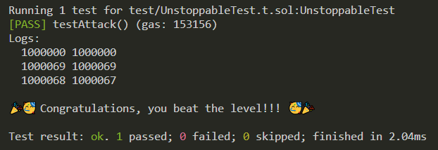

## Unstoppable
- Goal: Make the vault stop offering flash loans by making `flashLoan` always revert.
- Resources: https://twitter.com/bytes032/status/1631235276033990657 & https://gist.github.com/bytes032/68de03834881a41afa1d2d2f7b310d15
- Topics: Flashloans (ERC-3156) & Vaults (ERC-4626)
- Methodology & Lessons:
    0. Background:
        - ERC3156 flash loans invoke `onFlashLoan` callback after giving the receiver their token loan
        - `supply` = Number of virtual shares in ERC4626 vault. The virtual shares are an accounting representation of the deposited tokens.
        - `assets` = Actual tokens in ERC4626 vault.

    1. In our test, hack contract (us) first deposits 69 tokens to the vault: `vault.deposit(2 ether, address(unstoppableHack));`. Everything works properly for now.
        - `totalAssets` = 1_000_069
        - `totalSupply` = 1_000_069

    2. We then call `attack` passing in 1 token.
        - This calls `flashLoan` on the vault, referencing the hack contract for 1 token. All the checks pass because we haven't done anything naughty yet. Then this line: `ERC20(_token).safeTransfer(address(receiver), amount);` gives the hack contract 1 token as a loan. This immediately invokes the `onFlashLoan` callback function, directed at our hack contract.
        - Inside our `onFlashLoan`, which specifies what we are doing with our loan, we call the ERC4626.sol `withdraw` function on the vault for 1 token. The first thing `withdraw` does is call ERC4626.sol `previewWithdraw`, which is a confusing function.
            - `previewWithdraw` given an amount of assets, can calculate a number. It calculates that number based on `supply`, `totalAssets`, and `assets`. In the context of `previewWithdraw` being called within `withdraw`, it's calculating the number of virtual shares to be burned when withdrawing an amount of tokens. It calculates the number with this: `assets.mulDivUp(supply, totalAssets());`. 
            - `mulDivUp` is an assembly math function in `FixedPointMathLib.sol`. It takes in `x`, `y`, and `denominator` and returns `z`.
            - In context of `withdraw` function: `x` = assets, `y` = supply, `denominator` = total assets, `z` = shares to be burned.
            - Breaking down the equation: `z := add(gt(mod(mul(x, y), denominator), 0), div(mul(x, y), denominator))`. We do x * y / denominator, and if remainder is greater than 0, that portion returns 1, so we add 1, otherwise add 0.
            - General idea: `shares to be burned = (assets * total supply / total assets) + (0 if no remainder, 1 if remainder)`   
            - `assets` = x = 1 (we request 1 token for withdraw in the `onFlashLoan` function. Not to be confused with the 1 token received from the vault loan already).
            - `supply` = y = 1_000_069 (none of the virtual shares have been burned yet).
            - `total assets` = denominator = 1_000_068 (vault has given us one of our tokens, but withdraw function has NOT YET given us the 1 token we requested. The `withdraw` function calculates the `shares` BEFORE it does anything else, like burn the virtual shares or send the receiver their tokens. That's why `previewWithdraw` function is using the 1_000_068 value).
            - `shares to be burned = 1 * 1_000_069 / 1_000_068 + (0 or 1) = 1.000001 + 1 = 2.000001`. 2 shares will be burned when we withdraw 1 token.
            - The withdraw finishes and vault takes their loan back: `ERC20(_token).safeTransferFrom(address(receiver), address(this), amount + fee);`
        - State initial: `totalAssets = 1_000_000, totalSupply = 1_000_000`
        - State after deposit: `totalAssets = 1_000_069, totalSupply = 1_000_069`
        - State after vault sends us 1 token loan: `totalAssets = 1_000_068, totalSupply = 1_000_069` (sends us 1 token loan).
        - State after withdraw finishes in onFlashLoan: `totalAssets = 1_000_067, totalSupply = 1_000_067` (sends us our 1 requested token, and burns the 2 shares).
        - State after vault takes their loan back: `totalAssets = 1_000_068, totalSupply = 1_000_067`. Notice the mismatch now.
        - This causes `flashLoan` to always revert whenever a user wants to make a flash loan because we have messed up the accounting of the vault. This check in the vault's `flashLoan` now always reverts because the total supply is not equal to the balance before, which is the total assets: `if (convertToShares(totalSupply) != balanceBefore) revert InvalidBalance();`.

    3. Synopsis & Lessons: 
        - Calling `withdraw` for a vault during the `onFlashLoan` fallback messes up the accounting in this scenario. The flashloan gives you the tokens, which decrements `totalAssets`. Then `withdraw` calculates the number of virtual shares to burn based on that decremented `totalAssets`. Because `totalAsset` doesn't equal `totalSupply` at this point in time, the `mulDivUp` calculates a remainder, which causes the formula to add extra 1 to the shares to burn. So it burns an extra share, gives you your withdraw token, and then the vault takes back it's loan. This is why in the final state we see there is 1 less virtual share in the accounting. 
        - Install dependencies (OpenZeppelin & solmate) and then run `forge test -vv` to see.

