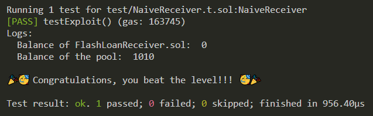
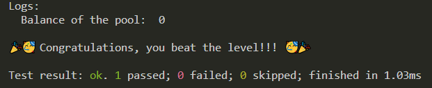
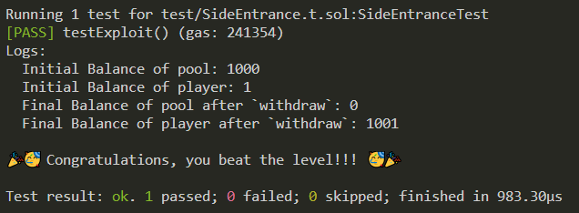
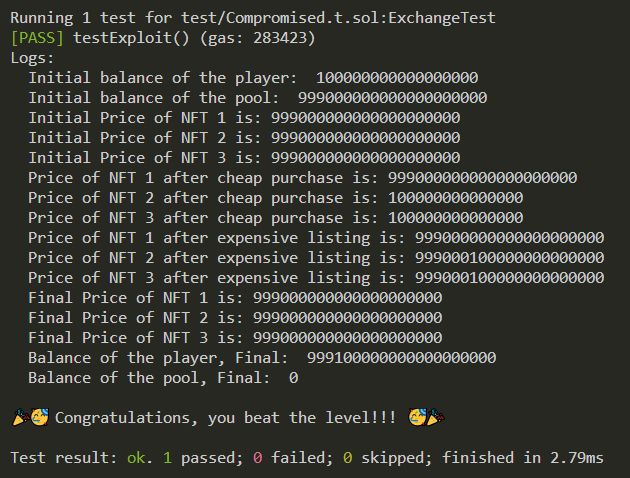
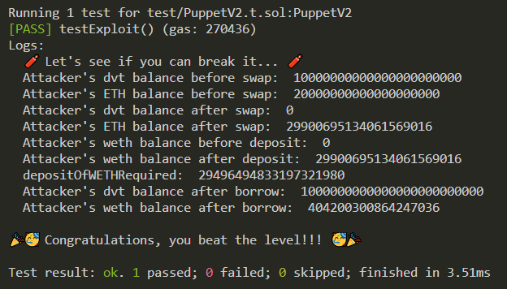

## Introduction, Setup, Tips
- THE most **detailed** writeups and solutions to the **DAMN VULNERABLE** defi ctf's using **FOUNDRY** (and maybe hardhat). I will be adding more solutions over time.
- Challenges: https://www.damnvulnerabledefi.xyz/ 
- Foundry templates for some challenges: https://github.com/nicolasgarcia214/damn-vulnerable-defi-foundry 
```bash
git clone https://github.com/alexbabits/damn-vulnerable-defi-ctfs
```
- Install dependencies (OpenZeppelin, solmate, solady).
- Run tests to complete challenges with: `forge test --match-path test/CONTRACT_NAME_HERE.t.sol -vv`.
- Tip: Some contracts in the root of `src` because are used in multiple challenges.

## #1 Unstoppable
- Goal: Make the vault stop offering flash loans by making `flashLoan` always revert.
- Resources: https://twitter.com/bytes032/status/1631235276033990657 & https://gist.github.com/bytes032/68de03834881a41afa1d2d2f7b310d15
- Topics: Flashloans (ERC-3156) & Vaults (ERC-4626)
- Methodology:
    0. Background:
        - ERC3156 flash loans invoke `onFlashLoan` callback after giving the receiver their token loan
        - `supply` = Number of virtual shares in ERC4626 vault. The virtual shares are an accounting representation of the deposited tokens.
        - `assets` = Actual tokens in ERC4626 vault.

    1. In our test, hack contract (us) first deposits 69 tokens to the vault: `vault.deposit(2 ether, address(unstoppableHack));`. Everything works properly for now.
        - `totalAssets` = 1_000_069
        - `totalSupply` = 1_000_069

    2. We then call `attack` passing in 1 token.
        - This calls `flashLoan` on the vault, referencing the hack contract for 1 token. All the checks pass because we haven't done anything naughty yet. Then this line: `ERC20(_token).safeTransfer(address(receiver), amount);` gives the hack contract 1 token as a loan. This immediately invokes the `onFlashLoan` callback function, directed at our hack contract.
        - Inside our `onFlashLoan`, which specifies what we are doing with our loan, we call the ERC4626.sol `withdraw` function on the vault for 1 token. The first thing `withdraw` does is call ERC4626.sol `previewWithdraw`, which is a confusing function.
            - `previewWithdraw` given an amount of assets, can calculate a number. It calculates that number based on `supply`, `totalAssets`, and `assets`. In the context of `previewWithdraw` being called within `withdraw`, it's calculating the number of virtual shares to be burned when withdrawing an amount of tokens. It calculates the number with this: `assets.mulDivUp(supply, totalAssets());`. 
            - `mulDivUp` is an assembly math function in `FixedPointMathLib.sol`. It takes in `x`, `y`, and `denominator` and returns `z`.
            - In context of `withdraw` function: `x` = assets, `y` = supply, `denominator` = total assets, `z` = shares to be burned.
            - Breaking down the equation: `z := add(gt(mod(mul(x, y), denominator), 0), div(mul(x, y), denominator))`. We do x * y / denominator, and if remainder is greater than 0, that portion returns 1, so we add 1, otherwise add 0.
            - General idea: `shares to be burned = (assets * total supply / total assets) + (0 if no remainder, 1 if remainder)`   
            - `assets` = x = 1 (we request 1 token for withdraw in the `onFlashLoan` function. Not to be confused with the 1 token received from the vault loan already).
            - `supply` = y = 1_000_069 (none of the virtual shares have been burned yet).
            - `total assets` = denominator = 1_000_068 (vault has given us one of our tokens, but withdraw function has NOT YET given us the 1 token we requested. The `withdraw` function calculates the `shares` BEFORE it does anything else, like burn the virtual shares or send the receiver their tokens. That's why `previewWithdraw` function is using the 1_000_068 value).
            - `shares to be burned = 1 * 1_000_069 / 1_000_068 + (0 or 1) = 1.000001 + 1 = 2.000001`. 2 shares will be burned when we withdraw 1 token.
            - The withdraw finishes and vault takes their loan back: `ERC20(_token).safeTransferFrom(address(receiver), address(this), amount + fee);`
        - State initial: `totalAssets = 1_000_000, totalSupply = 1_000_000`
        - State after deposit: `totalAssets = 1_000_069, totalSupply = 1_000_069`
        - State after vault sends us 1 token loan: `totalAssets = 1_000_068, totalSupply = 1_000_069` (sends us 1 token loan).
        - State after withdraw finishes in onFlashLoan: `totalAssets = 1_000_067, totalSupply = 1_000_067` (sends us our 1 requested token, and burns the 2 shares).
        - State after vault takes their loan back: `totalAssets = 1_000_068, totalSupply = 1_000_067`. Notice the mismatch now.
        - This causes `flashLoan` to always revert whenever a user wants to make a flash loan because we have messed up the accounting of the vault. This check in the vault's `flashLoan` now always reverts because the total supply is not equal to the balance before, which is the total assets: `if (convertToShares(totalSupply) != balanceBefore) revert InvalidBalance();`.

    3. Synopsis & Lessons: 
        - Calling `withdraw` for a vault during the `onFlashLoan` fallback messes up the accounting in this scenario. The flashloan gives you the tokens, which decrements `totalAssets`. Then `withdraw` calculates the number of virtual shares to burn based on that decremented `totalAssets`. Because `totalAsset` doesn't equal `totalSupply` at this point in time, the `mulDivUp` calculates a remainder, which causes the formula to add extra 1 to the shares to burn. So it burns an extra share, gives you your withdraw token, and then the vault takes back it's loan. This is why in the final state we see there is 1 less virtual share in the accounting. 


## #2 Naive Receiver
- Goal: Drain Naive Receiver's contract balance of 10 ETH in a single transaction. He has a contract setup that can call `onFlashLoan` for the pool. The pool has 1 ether fee per flash loan.
- Resources: https://www.youtube.com/watch?v=2tFlcH5k-jk, https://github.com/zach030/damnvulnerabledefi-foundry
- Topics: Flashloans (ERC-3156)
- Methodology:
    - `FlashLoanReceiver` ignored the first parameter in the `onFlashLoan` which is the `initiator`, which is the `msg.sender` of `flashLoan`.
    - Because his `onFlashLoan` function is external and missing the variable associated with the `initiator`, we can create a contract that calls `flashLoan` on his behalf, loan 0 tokens, and just `flashLoan` 10 times, which will cost him 10 ETH and successfully drain his contract. 
    - This can all happen in 1 transaction because upon deployment the `Attacker` contract must finish the loop and package that all into one transaction upon deployment. 
    - It doesn't even matter what we do in `onFlashLoan`, all we wanted to do is drain his account from the absurd flash loan fees.
    - Anyone can initiate a flash loan on behalf of this guy (FlashLoanReceiver.sol).




## #3 Truster
- Goal: Take all the tokens out of the pool, in a single transaction if possible. A pool offering flash loans of DVT tokens for free. You have nothing.
- Resources: https://github.com/zach030/damnvulnerabledefi-foundry
- Topics: Flashloans (ERC-3156), tokens (ERC-20)
- Methodology:
    - `flashLoan` has no safety checks on the `data` or `target` parameters, AND it makes a `functionCall` from OZ's `Address.sol` library, which is an external call where you can pass in a target address and data. So we can make a flash loan and pass in any arbitrary contract address and data to be executed for that contract address. (hint: You can pass in functions as data).
    - Attacker calls `flashLoan` requesting a loan of 0 tokens for ourself, passing in any malicious data we want. We decide to use `abi.encodeWithSignature` to package the erc20 `approve` function into parsable bytes data, with our address as the spender and the allowance amount being all the tokens in the pool.
    - The `flashLoan` in the pool then calls `target.functionCall(data);` where the target is the token address of the pool tokens and the function call data is the encoded approve function for ERC20 tokens. `functionCall` returns `functionCallWithValue(target, data, 0);`, and the `functionCallWithValue` is what actually makes the call with our data: `(bool success, bytes memory returndata) = target.call{value: value}(data);`. - The `target` is the token, and the function makes a low level call with our encoded `approve` function bytes data where we specified our address as the spender and the allowance as the entire pools balance. 
    - The `approve` function thus gets executed, approving our hack contract as the spender to be able to spend all the pools tokens. We can then `transferFrom` all of the pools tokens from the pool to us.




## #4 Side Entrance
- Goal: Pool with 1000 ETH allows for deposits and withdraw of ETH with no fee flash loans. Starting with 1 ETH in balance, pass the challenge by taking all ETH from the pool.
- Resources: https://github.com/zach030/damnvulnerabledefi-foundry
- Topics: Flashloans (ERC-3156)
- Methodology:
    - Attackers balance before is 0 ETH. Player's balance is 1 ETH. Player deploys the hack contract, attacker calls `attack` with 1000 ETH. This starts a `flashLoan` for 1000 ETH with no fees. 
    - Then the pool does `IFlashLoanEtherReceiver(msg.sender).execute{value: amount}();` which calls `execute` on the hackers contract.
    - Our `execute` function calls `deposit` on the pool which deposits the 1000 borrowed ETH back into the pool. This increases our tracked mapping balance as seen by the pool to now be 1000 ETH deposited, which can be withdrawn later.
    - Importantly, there is no pull action to get that 1000 ETH loan back at the end of the flash loan, all it does is check `if (address(this).balance < balanceBefore)` to complete the flash loan. This check passes because ( 1000 < 1000 ) is false. The pool's balance before was 1000 ETH, and after the flash loan it's real physical balance is 1000 ETH as well. This check is "supposed" to verify that the pool didn't lose money, which it technically did not at this state. However, the issue is that we manipulated the mapping of our virtual balance to be 1000 ETH during the flash loan by calling `deposit` and giving the pool our borrowed ETH.
    - Now the pool has it's 1000 ETH again and our hack contract has no ETH. But because we deposited that loaned ETH, the contract's balance mapping thinks we are eligible to claim that 1000 ETH.
    - We can call `withdraw` to withdraw 1000 ETH from the pool. Our `receive` function forwards that 1000 ETH straight to the owner (player).




## #5 The Rewarder
- Preface: **CURRENTLY NOT WORKING** OpenZeppelin currently broke this challenge with the release of v5.0.0 because there is no longer ERC20snapshot.sol for the AccountingToken. I tried using v4.9.3 of OZ which has ERC20snapshot.sol, and also grabbing its imports, but it's all messed up. This writeup will just be explaining and understanding the hack without the solution contracts properly running.
- Goal: A pool is offering flash loans of DVT tokens. And there's another pool offering rewards in tokens every 5 days for people who deposit their DVT tokens into it. Alice, Bob, Charlie, and David already deposited some DVT tokens and have won their rewards. You have no DVT, but int he upcoming reward round, you must claim most of the rewards for yourself.
- Resources: https://www.youtube.com/watch?v=zT5uNbGPaJ4, https://github.com/zach030/damnvulnerabledefi-foundry
- Topics: Flashloans (ERC-3156)
- Methodology:
    - Request a `flashLoan` for all the DVT tokens from `flashLoanPool`. This gives us `msg.sender` the tokens (us), and then calls `msg.sender.functionCall(abi.encodeWithSignature("receiveFlashLoan(uint256)", amount));`. So we are actually going to be calling `receiveFlashLoan` for the entire amount of DVT tokens that `flashLoanPool` has. We currently have all the DVT loaned to us.
    - Inside our attack we have the `receiveFlashLoan` function which is the callback during the flashloan. At this point we already have loaned and have all the DVT tokens. We first need to approve the `RewarderPool` to spend our tokens that we will deposit later. We then `deposit` the DVT tokens into `RewarderPool`, which mints us our virtual accounting tokens and then calls `distributeRewards`.
    - `distributeRewards` gives us our share of our rewards by minting and sending us some rewardTokens which are DVT, because we have in fact deposited (even though are deposit is the current borrowed DVT from the flash loans).
    - So now we've gotten some free DVT just from making a flashloan and depositing for the DVT rewards.
    - Then we immediately `withdraw` back our borrowed DVT and payback the flashloan. Then we transfer our free DVT we stole from our hack contract to our player personal address.
    - This is a stepwise exploit. You wait right before rewards are finished, then do a flashloan, deposit, get rewards, and then payback the loan. If stepwise calculations are done this is a big issue. It is better to calculate the rewards continuously rather than doing stepwise jumps.


## #6 Selfie
- Preface: **CURRENTLY NOT WORKING** OpenZeppelin currently broke this challenge with the release of v5.0.0 because there is no longer ERC20snapshot.sol.
- Goal: Pool offering flash loans of DVT tokens. It has a governance mechanism to control it. You start with no DVT tokens in balance. The pool has 1.5 million. Your goal is to take them all.
- Resources: https://www.youtube.com/watch?v=_2RHyMMLR9A, https://github.com/zach030/damnvulnerabledefi-foundry
- Topics: Flashloans (ERC-3156), DAO's
- Methodology:
    - Anyone can take a snapshot. We `flashLoan` all 1.5M tokens from pool. This is so we can pass the `_hasEnoughVotes` check inside the `queueAction` function. We take a snapshot after we have all the DVT tokens during the flashloan process and successfully pass the check. This allows us to propose and queue an action.
    - We can now act as the governance contract, call `queueAction`, and pass in `emergencyExit` with us as the receiver, which will give us all the funds. The flash loan must finish first, so `queueAction` is called, then we `approve` the pool to `transferFrom` our borrowed DVT back.
    - The flash loan finishes. We wait 2 days and then call `executeAction`. This makes the governance contract call `emergencyExit` with us as the reciever. Because the governance contract is the one calling `emergencyExit`, this passes the `onlyGovernance` modifier.


## #7 Compromised
- Preface/Notes: `_setupRole` is depreicated in OZ, replace any instances with `_grantRole`.
- Goal: A related on-chain exchange is selling (absurdly overpriced) collectibles called “DVNFT”, now at 999 ETH each. This price is fetched from an on-chain oracle, based on 3 trusted reporters: 0xA732...A105, 0xe924...9D15 and 0x81A5...850c. Starting with 0.1 ETH, obtain all ETH available in the exchange.

```sh
HTTP/2 200 OK
content-type: text/html
content-language: en
vary: Accept-Encoding
server: cloudflare

4d 48 68 6a 4e 6a 63 34 5a 57 59 78 59 57 45 30 4e 54 5a 6b 59 54 59 31 59 7a 5a 6d 59 7a 55 34 4e 6a 46 6b 4e 44 51 34 4f 54 4a 6a 5a 47 5a 68 59 7a 42 6a 4e 6d 4d 34 59 7a 49 31 4e 6a 42 69 5a 6a 42 6a 4f 57 5a 69 59 32 52 68 5a 54 4a 6d 4e 44 63 7a 4e 57 45 35

4d 48 67 79 4d 44 67 79 4e 44 4a 6a 4e 44 42 68 59 32 52 6d 59 54 6c 6c 5a 44 67 34 4f 57 55 32 4f 44 56 6a 4d 6a 4d 31 4e 44 64 68 59 32 4a 6c 5a 44 6c 69 5a 57 5a 6a 4e 6a 41 7a 4e 7a 46 6c 4f 54 67 33 4e 57 5a 69 59 32 51 33 4d 7a 59 7a 4e 44 42 69 59 6a 51 34
```

- Resources: https://www.youtube.com/watch?v=ecYTmC6tUXI, https://github.com/zach030/damnvulnerabledefi-foundry, https://www.rapidtables.com/convert/number/hex-to-ascii.html, https://www.base64decode.org/
- Topics: Exchanges, Oracles, & data types
- Methodology:
    - The hex data in the html request shown in the challenge briefing can be converted to ASCII and then to base64, which reveals the oracles private keys. Convert hex --> ASCII --> base64
```sh
MHhjNjc4ZWYxYWE0NTZkYTY1YzZmYzU4NjFkNDQ4OTJjZGZhYzBjNmM4YzI1NjBiZjBjOWZiY2RhZTJmNDczNWE5
0xc678ef1aa456da65c6fc5861d44892cdfac0c6c8c2560bf0c9fbcdae2f4735a9

MHgyMDgyNDJjNDBhY2RmYTllZDg4OWU2ODVjMjM1NDdhY2JlZDliZWZjNjAzNzFlOTg3NWZiY2Q3MzYzNDBiYjQ4
0x208242c40acdfa9ed889e685c23547acbed9befc60371e9875fbcd736340bb48
```
    
- Now that we can control the oracles private keys, we can also just derive the public address with `vm.addr(private key)`. We can now update the price with `postPrice`. We can act as an oracle and pass the `TRUSTED_SOURCE_ROLE` check in the `postPrice` function, so we set two of the three NFT's to a very low price of 0.0001 ETH. This will make the median price the very low price, which is what the oracle uses to determine the actual price of the symbol.
- Then we act as the player, calling `buyOne` on the `Exchange` contract to buy an NFT for 0.0001 ETH.
- Then we post our NFT for sale for the entire exchangeBalance (999+0.001), and `sellOne` sell it to the exchange. The player now has 999.1 ETH (started with 0.1), the exchange has 0 ETH.
- Then as the last part of the challenge, we act as the oracle and set those two NFT prices back to 999 ETH.




## #8 Puppet
- Preface: **CURRENTLY NOT WORKING** ABI broken (maybe my fault?) so I can't deploy Uniswap V1.
- Goal: Lending pool where users can borrow DVT. First need to deposit 2x the borrow amount in ETH as collateral. The pool has 100k DVT in liquidity. There is a DEX (Uniswap V1) with 10 ETH and 10 DVT in liquidity. Take all the tokens from the pool. You start with 25 ETH and 1000 DVT.
- Resources: https://www.youtube.com/watch?v=7pf3COTx708, https://github.com/zach030/damnvulnerabledefi-foundry, https://docs.uniswap.org/contracts/v1/reference/exchange, https://book.getfoundry.sh/cheatcodes/sign
- Topics: DEXs & LPs & oracles
- Methodology:

```sh
Initial State:
Player: 1_000 DVT, 25 ETH
Lending Pool: 100_000 DVT
Exchange: 10 DVT, 10 ETH (1 ETH per DVT)
```

- We first need to take the funds from the player and put them in our hack contract so this can all happen atomically in one transaction during the constructor deployment of the hack contract. We do this with `prepareAttack` which passes in the players `v,r,s, amount of DVT, UniswapV1Exchange address`. The `prepareAttack` calls `permit` which enables our hack contract to spend the DVT tokens on behalf of player in a single tx. Then we transfer the 1_000 DVT tokens with `transferFrom` to the hack contract. In our test we also transfer the value which is the players 25 ETH as well. Finally approve the uniswap v1 exchange contract to be able to spend that entire amount of DVT for our future "token to ETH" swap on Uniswap. 

```sh
State after calling prepareAttack:
Player: 0 DVT, 0 ETH
Hack Contract: 1_000 DVT, 25 ETH
Lending Pool: 100_000 DVT
Exchange: 10 DVT, 10 ETH (1 DVT per ETH)
```

- We then ABI call `tokenToEthSwapInput` which sells 1_000 DVT for a minimum of 1 ETH. This puts 1_000 DVT into the uniswap exchange pool, and takes out ETH. But it doesn't just take out 1 ETH, we receive nearly all of the 10 ETH that was in the exchange because we put in so many DVT tokens compared to the initial state of the uniswap pool balances. Using the formula `x * y = k` we can calculate how much ETH we will receive, where `x` is DVT, `y` is ETH, and `k` is the constant.
- `k = 10 * 10 = 100`. `k` must always remain 100. Therefore, after the swap the equation becomes `(10 + 1000) * y = 100`. So `y = 0.099 ETH`. This means the uniswap pools state after the swap will have 1010 DVT tokens and 0.099 ETH, giving us `10 - 0.099 = 9.901 ETH`.

```sh
State after 1000 DVT swap to ETH:
Player: 0 DVT, 0 ETH
Hack Contract: 0 DVT, 34.901 ETH
Lending Pool: 100_000 DVT
Exchange: 1_010 DVT, 0.099 ETH (10_202 DVT per ETH, 0.000098 ETH per DVT)
```

- We have made the price of DVT extremely cheap in the eyes of the oracle which uses a very bad practice of calculating the price as `return uniswapPair.balance * (10 ** 18) / token.balanceOf(uniswapPair);`. Inside our hack contract to prepare for borrowing, we can calculate `ethValue`, the amount of ETH we need to deposit as collateral into the lending pool to get their 100_000 DVT tokens as a loan now with the adjusted cheap price of DVT. The equation boils down to `DVT * (uni pool: ETH/DVT) * 2`. In our case, that is `100_000 * (0.099 ETH / 1_010 DVT) * 2 = 19.6 ETH`. So 19.6 ETH is needed as collateral to borrow 100_000 DVT. We call `borrow`, sending 19.6 ETH requesting to borrow the entire 100_000 DVT. We calculated `ethValue` beforehand so we know exactly how much to send to the pool for the 100_000 DVT tokens.
- Note: There was no flashloan here, but instead a lending pool that let us borrow with ETH collateral. We are not forced or required to ever return the borrowed tokens. If we do not return the borrowed tokens, the lending pool simply keeps our 19.6 ETH collateral, which is fine for this challenge.

```sh
State after borrowing DVT from lending pool:
Player: 0 DVT, 0 ETH
Hack Contract: 100_000 DVT, 15.301 ETH
Lending Pool: 0 DVT, 19.6 ETH
Exchange: 1_010 DVT, 0.099 ETH
```

- Optional Step: We can return the Uniswap Exchange balance pool to 10 DVT and 10 ETH to try and obfuscate what happened. This is futile because the activity is all on chain and just costs us ETH to attempt to cover up what happened. 
- Using `ethToTokenSwapOutput` and setting a maximum value of 10 ETH to send, and requesting to buy 1000 DVT. We won't need to send the full 10 ETH  because of `x * y = k` where `k = 100` still. The equation now becomes `(1010 - 1000) * (0.099 + y) = 100`. So `y = 9.901`, so we will be sending 9.901 ETH for 1000 DVT. This resets the pool to 10 DVT and 10 ETH. Since the prices are back to normal after our attempted obfusaction, they just keep our 19.6 ETH.

```sh
State after attempted obfuscation of hack:
Player: 0 DVT, 0 ETH
Hack Contract: 101_000 DVT, 5.4 ETH
Lending Pool: 0 DVT, 19.6 ETH
Exchange: 10 DVT, 10 ETH
```

- Lastly, we transfer the ETH and DVT from our hack contract back to the player.

```sh
State after hack contract finishes and sends player funds:
Player: 101_000 DVT, 5.4 ETH
Hack Contract: 0 DVT, 0 ETH
Lending Pool: 0 DVT, 19.6 ETH
Exchange: 10 DVT, 10 ETH
```


## #9 Puppet V2
- Preface: Currently working! But can be fragile. You have to build Uniswap V2 carefully. I had a `duplicate bytecode` error, so I removed the bytecode from the .json file and it worked. This was the repo I mostly used: https://github.com/ret2basic/damn-vulnerable-defi-foundry from https://www.ctfwriteup.com/web3-security-research/damn-vulnerable-defi/puppet-v2

- Goal: Uniswap v2 exchange is the price oracle for a lending pool. You start with 20 ETH and 10000 DVT tokens in balance. The pool has a 1,000,000 DVT tokens in balance. Drain the pool.

- Topics: DEXs & LPs & oracles

- Resources: https://github.com/Uniswap/v2-periphery, https://github.com/Uniswap/v2-core, https://docs.uniswap.org/contracts/v2/overview, https://www.youtube.com/watch?v=F4kqItXHDb0

- Methodology:

```sh
State initially:
Attacker: 10_000 DVT, 20 ETH, 0 WETH
Lending Pool: 1_000_000 DVT, 0 ETH, 0 WETH
Exchange: 100 DVT, 10 ETH
```

- The first thing we have to do is approve the router to spend our 10_000 DVT tokens, because we are looking to sell them all for the ETH in the exchange to manipulate the oracle price. Then we call `swapExactTokensForETH` on the router and request to swap all our 10_000 DVT tokens for a minimum of 1 ETH, from DVT to ETH, for our attacker. However, we know we'll get more than 1 ETH. Let's calculate. 
- `x * y = k` thus `100 DVT * 10 ETH = 1_000 = k`. Recall `k` must remain constant during the swap. 
- `(100 + 10_000) DVT * (10 - y) ETH = 1_000`. Therefore `y = 9.999` which is the amount of ETH we will receive. This isn't exact as it doesn't account for gas, so let `y = 9.9`.
- The attacker then calls `deposit` function on `weth` that just exchanges all his 20+9.9 ETH for WETH.

```sh
State after attacker swaps all DVT for ETH, and then does deposit to swap ETH to WETH
Attacker: 10_000 DVT, 0 ETH, 29.9 WETH
Lending Pool: 1_000_000 DVT, 0 WETH
Exchange: 10_100 DVT, 0.1 ETH ( 101_000 DVT per ETH, 0.0000099 ETH per DVT)
```

- Because DVT is so cheap now, the oracles quote price will reflect that. So we approve the lending pool for all our WETH, and then we want to calculate how much WETH collateral is required to take the 1_000_000 DVT from the lending pool with `calculateDepositOfWETHRequired`. This calculation goes through `_getOracleQuote` and `quote` functions, which in our case boils down to: 
- `WETH collat req = ((lending pools DVT * uniswap reserve WETH) / uniswap reserve DVT) * 3`. Therefore, 
- `WETH collat req = ((1_000_000 * 0.1) / 10_100 ) * 3` = 29.7 WETH collateral required.
- We then call `borrow` for the pool amount which passes successfully because we have enough collateral, yielding us 1_000_000 DVT for 29.7 WETH.

```sh
State after attacker successfully borrows DVT
Attacker: 1_010_000 DVT, 0 ETH, 0.2 WETH
Lending Pool: 0 DVT, 29.7 WETH
```




## #10 Free Rider

## #11 Backdoor

## #12 Climber

## #13 Wallet Mining

## #14 Puppet V3

## #15 ABI Smuggling