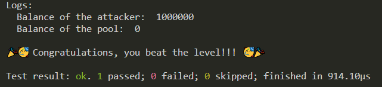

## Hello
- This repo contains the most detailed writeups and solutions to the DAMN VULNERABLE defi ctf's using FOUNDRY (and maybe hardhat in the future). I will be adding more solutions over time.
- Find the challenges here: https://www.damnvulnerabledefi.xyz/
- Install dependencies (OpenZeppelin, solmate, solady) and then run `forge test --match-path test/CONTRACT_NAME_HERE.t.sol -vv`.
- Using https://github.com/nicolasgarcia214/damn-vulnerable-defi-foundry for some of the foundry test templates.

## #1 Unstoppable
- Goal: Make the vault stop offering flash loans by making `flashLoan` always revert.
- Resources: https://twitter.com/bytes032/status/1631235276033990657 & https://gist.github.com/bytes032/68de03834881a41afa1d2d2f7b310d15
- Topics: Flashloans (ERC-3156) & Vaults (ERC-4626)
- Methodology:
    0. Background:
        - ERC3156 flash loans invoke `onFlashLoan` callback after giving the receiver their token loan
        - `supply` = Number of virtual shares in ERC4626 vault. The virtual shares are an accounting representation of the deposited tokens.
        - `assets` = Actual tokens in ERC4626 vault.

    1. In our test, hack contract (us) first deposits 69 tokens to the vault: `vault.deposit(2 ether, address(unstoppableHack));`. Everything works properly for now.
        - `totalAssets` = 1_000_069
        - `totalSupply` = 1_000_069

    2. We then call `attack` passing in 1 token.
        - This calls `flashLoan` on the vault, referencing the hack contract for 1 token. All the checks pass because we haven't done anything naughty yet. Then this line: `ERC20(_token).safeTransfer(address(receiver), amount);` gives the hack contract 1 token as a loan. This immediately invokes the `onFlashLoan` callback function, directed at our hack contract.
        - Inside our `onFlashLoan`, which specifies what we are doing with our loan, we call the ERC4626.sol `withdraw` function on the vault for 1 token. The first thing `withdraw` does is call ERC4626.sol `previewWithdraw`, which is a confusing function.
            - `previewWithdraw` given an amount of assets, can calculate a number. It calculates that number based on `supply`, `totalAssets`, and `assets`. In the context of `previewWithdraw` being called within `withdraw`, it's calculating the number of virtual shares to be burned when withdrawing an amount of tokens. It calculates the number with this: `assets.mulDivUp(supply, totalAssets());`. 
            - `mulDivUp` is an assembly math function in `FixedPointMathLib.sol`. It takes in `x`, `y`, and `denominator` and returns `z`.
            - In context of `withdraw` function: `x` = assets, `y` = supply, `denominator` = total assets, `z` = shares to be burned.
            - Breaking down the equation: `z := add(gt(mod(mul(x, y), denominator), 0), div(mul(x, y), denominator))`. We do x * y / denominator, and if remainder is greater than 0, that portion returns 1, so we add 1, otherwise add 0.
            - General idea: `shares to be burned = (assets * total supply / total assets) + (0 if no remainder, 1 if remainder)`   
            - `assets` = x = 1 (we request 1 token for withdraw in the `onFlashLoan` function. Not to be confused with the 1 token received from the vault loan already).
            - `supply` = y = 1_000_069 (none of the virtual shares have been burned yet).
            - `total assets` = denominator = 1_000_068 (vault has given us one of our tokens, but withdraw function has NOT YET given us the 1 token we requested. The `withdraw` function calculates the `shares` BEFORE it does anything else, like burn the virtual shares or send the receiver their tokens. That's why `previewWithdraw` function is using the 1_000_068 value).
            - `shares to be burned = 1 * 1_000_069 / 1_000_068 + (0 or 1) = 1.000001 + 1 = 2.000001`. 2 shares will be burned when we withdraw 1 token.
            - The withdraw finishes and vault takes their loan back: `ERC20(_token).safeTransferFrom(address(receiver), address(this), amount + fee);`
        - State initial: `totalAssets = 1_000_000, totalSupply = 1_000_000`
        - State after deposit: `totalAssets = 1_000_069, totalSupply = 1_000_069`
        - State after vault sends us 1 token loan: `totalAssets = 1_000_068, totalSupply = 1_000_069` (sends us 1 token loan).
        - State after withdraw finishes in onFlashLoan: `totalAssets = 1_000_067, totalSupply = 1_000_067` (sends us our 1 requested token, and burns the 2 shares).
        - State after vault takes their loan back: `totalAssets = 1_000_068, totalSupply = 1_000_067`. Notice the mismatch now.
        - This causes `flashLoan` to always revert whenever a user wants to make a flash loan because we have messed up the accounting of the vault. This check in the vault's `flashLoan` now always reverts because the total supply is not equal to the balance before, which is the total assets: `if (convertToShares(totalSupply) != balanceBefore) revert InvalidBalance();`.

    3. Synopsis & Lessons: 
        - Calling `withdraw` for a vault during the `onFlashLoan` fallback messes up the accounting in this scenario. The flashloan gives you the tokens, which decrements `totalAssets`. Then `withdraw` calculates the number of virtual shares to burn based on that decremented `totalAssets`. Because `totalAsset` doesn't equal `totalSupply` at this point in time, the `mulDivUp` calculates a remainder, which causes the formula to add extra 1 to the shares to burn. So it burns an extra share, gives you your withdraw token, and then the vault takes back it's loan. This is why in the final state we see there is 1 less virtual share in the accounting. 

## #2 Naive Receiver
- Goal: Drain Naive Receiver's contract balance of 10 ETH in a single transaction. He has a contract setup that can call `onFlashLoan` for the pool. The pool has 1 ether fee per flash loan.
- Resources: https://www.youtube.com/watch?v=2tFlcH5k-jk, https://github.com/zach030/damnvulnerabledefi-foundry
- Topics: Flashloans (ERC-3156)
- Methodology:
    - `FlashLoanReceiver` ignored the first parameter in the `onFlashLoan` which is the `initiator`, which is the `msg.sender` of `flashLoan`.
    - Because his `onFlashLoan` function is external and missing the variable associated with the `initiator`, we can create a contract that calls `flashLoan` on his behalf, loan 0 tokens, and just `flashLoan` 10 times, which will cost him 10 ETH and successfully drain his contract. 
    - This can all happen in 1 transaction because upon deployment the `Attacker` contract must finish the loop and package that all into one transaction upon deployment. 
    - It doesn't even matter what we do in `onFlashLoan`, all we wanted to do is drain his account from the absurd flash loan fees.
    - Anyone can initiate a flash loan on behalf of this guy (FlashLoanReceiver.sol).

## #3 Truster
- Goal: Take all the tokens out of the pool, in a single transaction if possible. A pool offering flash loans of DVT tokens for free. You have nothing.
- Resources: https://github.com/zach030/damnvulnerabledefi-foundry
- Topics: Flashloans (ERC-3156), tokens (ERC-20)
- Methodology:
    - `flashLoan` has no safety checks on the `data` or `target` parameters, AND it makes a `functionCall` from OZ's `Address.sol` library, which is an external call where you can pass in a target address and data. So we can make a flash loan and pass in any arbitrary contract address and data to be executed for that contract address. (hint: You can pass in functions as data).
    - Attacker calls `flashLoan` requesting a loan of 0 tokens for ourself, passing in any malicious data we want. We decide to use `abi.encodeWithSignature` to package the erc20 `approve` function into parsable bytes data, with our address as the spender and the allowance amount being all the tokens in the pool.
    - The `flashLoan` in the pool then calls `target.functionCall(data);` where the target is the token address of the pool tokens and the function call data is the encoded approve function for ERC20 tokens. `functionCall` returns `functionCallWithValue(target, data, 0);`, and the `functionCallWithValue` is what actually makes the call with our data: `(bool success, bytes memory returndata) = target.call{value: value}(data);`. - The `target` is the token, and the function makes a low level call with our encoded `approve` function bytes data where we specified our address as the spender and the allowance as the entire pools balance. 
    - The `approve` function thus gets executed, approving our hack contract as the spender to be able to spend all the pools tokens. We can then `transferFrom` all of the pools tokens from the pool to us.

## #4 Side Entrance
- Goal: Pool with 1000 ETH allows for deposits and withdraw of ETH with no fee flash loans. Starting with 1 ETH in balance, pass the challenge by taking all ETH from the pool.
- Resources: https://github.com/zach030/damnvulnerabledefi-foundry
- Topics: Flashloans (ERC-3156)
- Methodology:
    - Attackers balance before is 0 ETH. Player's balance is 1 ETH. Player deploys the hack contract, attacker calls `attack` with 1000 ETH. This starts a `flashLoan` for 1000 ETH with no fees. 
    - Then the pool does `IFlashLoanEtherReceiver(msg.sender).execute{value: amount}();` which calls `execute` on the hackers contract.
    - Our `execute` function calls `deposit` on the pool which deposits the 1000 borrowed ETH back into the pool. This increases our tracked mapping balance as seen by the pool to now be 1000 ETH deposited, which can be withdrawn later.
    - Importantly, there is no pull action to get that 1000 ETH loan back at the end of the flash loan, all it does is check `if (address(this).balance < balanceBefore)` to complete the flash loan. This check passes because ( 1000 < 1000 ) is false. The pool's balance before was 1000 ETH, and after the flash loan it's real physical balance is 1000 ETH as well. This check is "supposed" to verify that the pool didn't lose money, which it technically did not at this state. However, the issue is that we manipulated the mapping of our virtual balance to be 1000 ETH during the flash loan by calling `deposit` and giving the pool our borrowed ETH.
    - Now the pool has it's 1000 ETH again and our hack contract has no ETH. But because we deposited that loaned ETH, the contract's balance mapping thinks we are eligible to claim that 1000 ETH.
    - We can call `withdraw` to withdraw 1000 ETH from the pool. Our `receive` function forwards that 1000 ETH straight to the owner (player).

